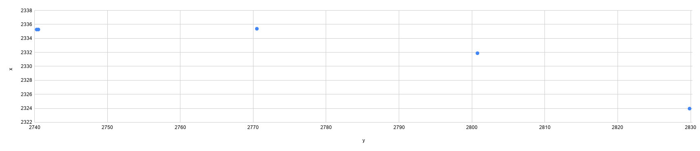
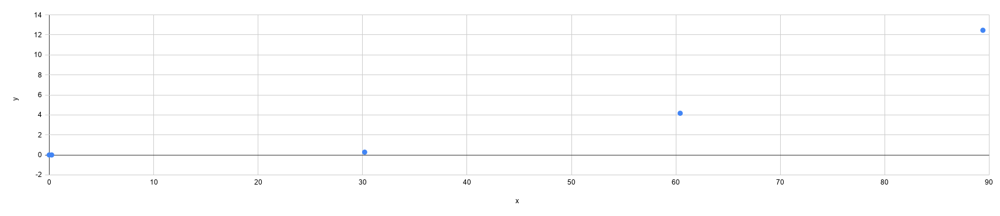
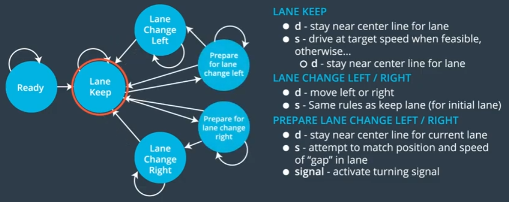

# CarND-Path-Planning-Project
The code model for generating paths is described in detail in this document. The steps also commented in code. 
### Goals
* The car is able to drive without incident all alone the high way. The waypoint on the highway is supplied every 30m along the road, goes from 0 to 6945.554m (4.32miles).
* speed < 50 MPH
* acceleration < 10 m/s^2
* jerk < 10 m/s^3
* no collision
* times for changing lanes < 3 sec
* stay on the road
-----
### Reference
I started this project following the [video](https://classroom.udacity.com/nanodegrees/nd013/parts/b9040951-b43f-4dd3-8b16-76e7b52f4d9d/modules/85ece059-1351-4599-bb2c-0095d6534c8c/lessons/407a2efa-3383-480f-9266-5981440b09b3/concepts/3bdfeb8c-8dd6-49a7-9d08-beff6703792d) from Udacity, in which the mentors suggest using [spline](https://kluge.in-chemnitz.de/opensource/spline/) for trajectory planning to generate a smooth trajectory for every time step. Than used the finite state machine [code](https://classroom.udacity.com/nanodegrees/nd013/parts/b9040951-b43f-4dd3-8b16-76e7b52f4d9d/modules/85ece059-1351-4599-bb2c-0095d6534c8c/lessons/59e5ec59-905b-4c37-9784-27099661f9e5/concepts/2c4a8fdd-4072-425f-b5ae-95849d5fd4d8) to do a behavior planning.
### code structure
> `main.cpp`: trajectory planning
> * update rate 50 hz
> * generate trajectory considering kinematics constraints
> * updating command velocity `Vehicle::cmd_vel`
> * use `DEBUG` to enable printing log.

> `vehicle.cpp`: behavior planning
> * update rate 5 hz 
> * class `Vehicle` stores the vehicle state for planning (on each sensor fusion data updating, for convenience)
> * use a finite state machine to determine next state with the lowest cost and the corresponding lane.
> * use `SIM` to enable functions for simulation.

> `cost.cpp`: cost functions for calculating the cost of each possible states.
### trajectory planning
#### spline inputs
The generated spline passes the 5 (x,y) points given to it. This makes vehicle to stay inside the lane.
On Every update loop, `previous_path_x` and `previous_path_y` tells the points the vehicle will (but not yet) pass, using 2 `previous_path_x` and `previous_path_y`, and 3 additional waypoints to generate new spline. Combining 2 previous points makes new spline more continuous and smooth with previous spline. If there's no previous points(like at beginning), extrapolate from current yaw angle. (`main.cpp` line #184 to #187)
```cpp
// extrapolate previous position
previous_path_x = car_x - cos(deg2rad(car_yaw));
previous_path_y = car_y - sin(deg2rad(car_yaw));
```
3 additional waypoints can be taken by helper function `getXY()`, to get the  waypoint correspond to `map_waypoints`. This function transfers `map_waypoints` to FRENET coordinate and returns (x,y) on map coordinate for any given (s,d) position. 
#### waypoint distance
3 additional waypoints are incremented with the same distance, but the distance should be calculated in FRENET coordinate to assure the same increment. The increment should be started from `end_path_s`(`main.cpp` line #198), so there are enough space for each waypoints. The distance should be small enough to reflect curvature changing and large enough to generate smooth lane change trajectory. In testing a range from 30 to 40 met the requirement, and eventually 30 was used (in `main.cpp` #198).
#### homogeneous transformation
The 5 points are in map coordinate, which means these x points aren't guaranteed to be in ascending order(depending on heading direction), and that will violet the Spline generator requirements. So a new local coordinate, origin at the starting point and rotated to make the x axle align with the first 2 points, is used to get local x points in ascending order. (`main.cpp` line #208 to #215)

Below figure shows the waypoints in some instance. Note x axle is vertical for easier visualizing. x coordinates are decreasing and the yaw angle is 89 degree. 

Use the first point as the origin of local coordinate and than rotates all point 89 degree clockwise makes the valid input for spline generation. 
```cpp
Eigen::Vector2d vector_translation = translation({-x_trans, -y_trans}, {Xs[i], Ys[i]});
Eigen::Vector2d local_pose = rotation2d(vector_translation, -yaw_rad);
```


#### pick points for trajectory
From the generated spline, points are picked as the command positions for the vehicle to drive to one point each loop (at least 0.02 sec), which means a vehicle took over 1 sec to finish *50* command points. Actually the vehicle had driven more than one point every update loop because it ran for more than 0.02 sec each loop. Adding new points each loop maintains 50 points as the task buffer for the vehicle. (`main.cpp` line #239)

This step infect the kinematics, which is derived by dividing the distance between points with passing time. The method to determine a appropriate `next_x` and therefore get a corresponding `next_y` on the spline, according to the reference [video](https://youtu.be/7sI3VHFPP0w?t=2013), is to calculate the distance(`spline_dist`) between the second waypoints(the last `previous_path`) and the point which x coordinate is *30* meters to `previous_path_x` along with its corresponding `y` from spline (`main.cpp` line #224).

If the value less than 30 meters, noise error will cause speed to go over 1% buffer left.
```cpp
// The displacement made within 0.02 sec each loop is the speed multiplied by time
displacement_each_step = cmd_vel * loop_t;
```
The `cmd_vel` is updated by steps described in the next section.

Dividing the `spline_dist` with displacement_each_step gives the total steps that needed to go through.
```cpp
steps = spline_dist / displacement_each_step;
```
The `next_waypoint_x` is 30 meters away, and it takes steps to go through. So each `x_delta` is given by dividing `next_waypoint_x` with steps. (`main.cpp` line #245)
```cpp
x_delta = next_waypoint_x / steps;
```
After determining `x_delta`, the `next_x` and `next_y` can be picked under the speed restriction. Finally, transfer this point from local coordinate to map coordinate. (`main.cpp` line #281) 
#### determine cmd_vel
Using following parameters for calculating velocity. (`main.cpp` line #54 to #55)
* `speed_limit` is 1% lower than 50 MPH as buffer.
* `accel_limit` is 50% of 10m/s^2 as we are using straight distance between waypoints but the true distance traveled is longer within 0.02 time step so the corresponding kinematics will be larger.
* `Vehicle::lane_speed` is the speed of the vehicle ahead on the lane. (`vehicle.cpp` line #112)
* `Vehicle::preferred_buffer` is the safe distance between other vehicles. (`vehicle.cpp` line #43)
Two steps to determine the velocity 
##### too close?
On each update loop, if the **future distance** with the vehicle ahead is less than `Vehicle::preferred_buffer`, `too_close` will set to true to enable decelerating. (`main.cpp` line #141 to #160). The position of next update step is predicted by assuming all vehicle is moving with continuous velocity, because the time step is as small as (0.02sec).
##### which velocity limit?
When changing lane, the curvature will be sharper than keeping lane, causing a larger velocity and acceleration. If the ego vehicle start changing lane with a speed close to `speed_limit`, than it is more likely to violate the constrains. So using `Vehicle::lane_speed` that consider the lane's traffic and is lower than `speed_limit`(that is the reason of changing lane), to be the velocity limit. (`main.cpp` line #230 to #233)
When picking points from spline, the `cmd_vel` is updated by adding or reducing acceleration * 0.02 sec for each point and thresholds by the chosen velocity limit. (`main.cpp` line #241 to #244)
### behavior planning 
On updating the vehicle behavior and kinematic states are stored in the `Vehicle` class(`main.cpp` line #133). But weather changing lane is determine 10 times slower than 0.02 sec loop by  finite state machine which chose the lowest cost from 5 states and the determined lane is stored in `Vehicle::goal_lane`(`main.cpp` line #136 to #140).
* *KL* keep lane
* *PLCL* prepare lane change left
* *PLCR* prepare lane change right
* *LCL* lane change left
* *LCR* lane change right

The Ready state is set as *CS* (constant speed) at the beginning.(`vehicle.cpp` line #19)
The state changing rules is the same as the [reference](https://classroom.udacity.com/nanodegrees/nd013/parts/b9040951-b43f-4dd3-8b16-76e7b52f4d9d/modules/85ece059-1351-4599-bb2c-0095d6534c8c/lessons/407a2efa-3383-480f-9266-5981440b09b3/concepts/3bdfeb8c-8dd6-49a7-9d08-beff6703792d): 
On Updating every 0.2 sec, `choose_next_state()` first filtered the possible next behavioral states from current behavioral states shawn as figure above (`vehicle.cpp` line #93).
#### rough prediction
Than for each possible state predicted the vehicle's position, velocity and acceleration based on the arrived sensor fusion observation data, `predictions` using `generate_trajectory()` (`vehicle.cpp` line #102), which does not generate precise steps as *trajectory planning* does, but a rough prediction after 1 sec. Based on the rough prediction, the best lane were chosen as the input of *trajectory planning* and the future 50 steps in 1 sec can be generated. 
 
The rough prediction is done by `get_kinematics()` to gets kinematics (position, velocity, acceleration) for a given lane after 1 sec. It tries to choose the maximum velocity and acceleration, given other vehicle positions and accel/velocity constraints in FRENET coordinate, and the `vx` and `vy` from `predictions` are transfer to its vector sum.
```cpp
// t = 1 sec
velocity = sqrt(vx * vx + vy * vy);
acceleration = (v_1 - v_0)/t;
position = current_s + velocity * t + 1/2 * acceleration * t^2
```
The velocity after 1 sec is determined by following logic (`vehicle.cpp` line #184 to #201):
1. If there's no vehicle ahead on the intended lane, accelerate without violating the speed limit (50 MPH * 99%).
2. If found vehicle ahead but no vehicles behind, accelerate or decelerate until the safe distance, `Vehicle::preferred_buffer`, is reached under speed limit. (`vehicle.cpp` line #193)
```cpp 
// t = 1 sec
vehicle_ahead_future_position = vehicle_ahead_s + vehicle_ahead_velocity * t 
// since the acceleration of vehicle_ahead wasn't given, assume constant velocity
// safety distance and trajectory planner will take care of the rest.
ego_future_position = vehicle_ahead_future_position - preferred_buffer;
ego_velocity * t = ego_future_position - ego_s - 1/2 * ego_acceleration * t^2
``` 
3. If found vehicles both ahead and behind, follow the velocity of vehicles ahead(must travel at the speed of traffic, regardless of preferred buffer).
#### behavior for state
trajectory is vector of 2 `Vehicle` object with vehicle's position, velocity, and acceleration.
```cpp
vector<Vehicle> trajectory = [kinematic_start, kinematic_end]; //end is after 1 sec 
```
* *CS*: `constant_speed_trajectory()` acceleration 0 (`vehicle.cpp` line #209)
* *KL*: `keep_lane_trajectory()` check traffic speed on sane lane (`vehicle.cpp` line #218)
* *PLCL* and *PLCR*: `prep_lane_change_trajectory()` check vehicle behind current lane, and keep speed so as not to collide with vehicle behind. If there is no vehicle behind, align with the traffic speed of intended lane. (`vehicle.cpp` line #231)
* *LCL* and *LCR*: `lane_change_trajectory()` change lane if the distance with vehicles on the intended lane is enough as `Vehicle::preferred_buffer` (both ahead and behind). If the distance is not enough, return empty trajectory to reject this state. (`vehicle.cpp` line #269)
#### cost for state 
`calculate_cost()` calculates the "cost" associated with that trajectory. The lowest is chosen as the best state along with its lane and traffic speed (`vehicle.cpp` line #107 to #112).
`cf_list` is the cost function list which contains:
* `inefficiency_cost()` (`cost.cpp` line #50 to #71): Cost becomes higher for trajectories with intended lane and final lane that have traffic slower than vehicle's target speed.
* `off_road_cost()` (`cost.cpp` line #85 to #92): Penalizes trajectories that drive off the road. But actually the `successor_states()` won't consider changing left/right if  current lane is the left/right most lane. (`vehicle.cpp` line #139 and #144)
* `change_lane_cost()` (`cost.cpp` line #94 to #101): Rewards trajectories that keep current lane. When lanes are with similar traffic speed this function prefer keeping lane. 
